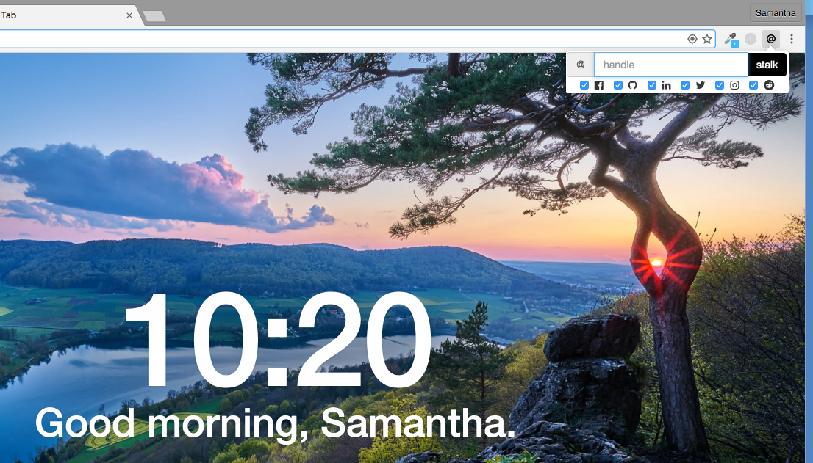

# Handle Stalker

Chrome extension that aims to open all the major social networks pages related to a specific handle.

https://chrome.google.com/webstore/detail/handle-stalker/ofdhgbjblhdkepgmafdeppjcmaaegllf

## Demo

> [Watch video](https://www.youtube.com/watch?v=P6GE1JLifqQ).

## Install

This browser extension available for:

|  |
|:---:|
| [Chrome](https://chrome.google.com/webstore/detail/handle-stalker/ofdhgbjblhdkepgmafdeppjcmaaegllf) |

## Testing

###### Chrome

1. Clone or [download](https://github.com/samanthakem/HandleStalker/archive/master.zip) project;

2. Navigate to `chrome://extensions`

3. Click on `Load unpacked extension...`

4. Select the `extension` folder

## Contributing

If you want to help, please read the [Contributing](https://github.com/samanthakem/HandleStalker/blob/master/CONTRIBUTING.md) guide.

## License

[MIT License](https://github.com/samanthakem/HandleStalker/blob/master/LICENSE) © Samantha Monteiro
